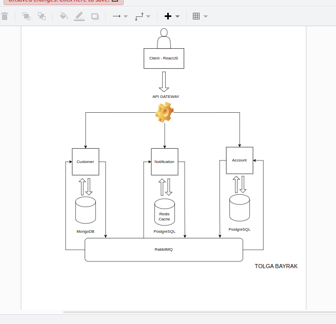

# Alaska App
## _Banking Application With Microservices_

## Diagram
</img>


## Features
- Accounts
- Customers
- Notifications
- UI

## Tech

Alaska uses these technologies: </br>
-- NodeJS </br>
-- RabbitMQ </br>
-- Redis </br>
-- PostgreSQL </br>
-- MongoDB </br>
-- ReactJS 


## Installation

Alaska requires [Node.js](https://nodejs.org/) v16+ to run.

Install the dependencies and devDependencies and start the server.

### Dont forget the env variables

### Account-Service
```sh
cd account-service
npm i
npm start
```


### Customer-Service
```sh
cd account-service
npm i
npm start
```


### Notification-Service
```sh
cd account-service
npm i
npm start
```


## Docker

##### RabbitMQ
:
```sh
cd rabbitmq
docker compose up
```


## License

MIT


